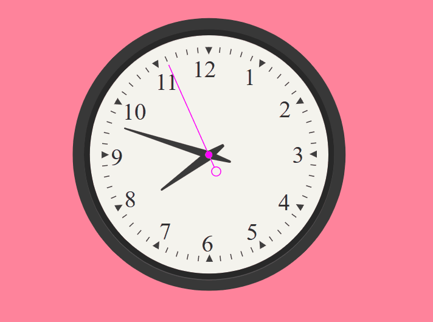

# JavaScript in Web Browsers

## 🎯 Objectives

The goal of this project is to demonstrate my understanding of basic JavaScript concepts such as variables, functions, and objects. I will also learn how to use JavaScript to manipulate the DOM and create interactive web pages.

## ✅ Task: Animated Clock

- Open the `animated-clock` folder in VS Code and open the `index.html` file in your browser.
- You should see a clock with a second hand, minute hand, and hour hand.
- My task is to make the clock animated so that the hands move in real time.
- I can also try to incorporate the ticking sound effect from the media folder.
- For this task, I will need to edit just the script.js file.

- **_Hint:_** Look up the [Date](https://developer.mozilla.org/en-US/docs/Web/JavaScript/Reference/Global_Objects/Date) object in JavaScript.
- **_Hint:_** Look up the [Audio](https://developer.mozilla.org/en-US/docs/Web/API/HTMLAudioElement/Audio) object in JavaScript.
- **_Hint:_** Look up the [setInterval](https://developer.mozilla.org/en-US/docs/Web/API/WindowOrWorkerGlobalScope/setInterval) method in JavaScript.
- **_Hint:_** Look up the [setTimeout](https://developer.mozilla.org/en-US/docs/Web/API/WindowOrWorkerGlobalScope/setTimeout) method in JavaScript.
- **_Hint:_** Look up the [transform](https://developer.mozilla.org/en-US/docs/Web/CSS/transform) property in CSS.
- **_Hint:_** Look up the [transform SVG attribute](https://developer.mozilla.org/en-US/docs/Web/SVG/Attribute/transform) in SVG.

## ☕ Resources

If you need help with any of the concepts covered in this project, here are some resources that might be useful:

- [MDN Web Docs](https://developer.mozilla.org/en-US/docs/Web/JavaScript)
- [W3Schools](https://www.w3schools.com/js/)
- [JavaScript.info](https://javascript.info/)

**_🍀Good luck!_**

- Here is a GIF of the expected result:

